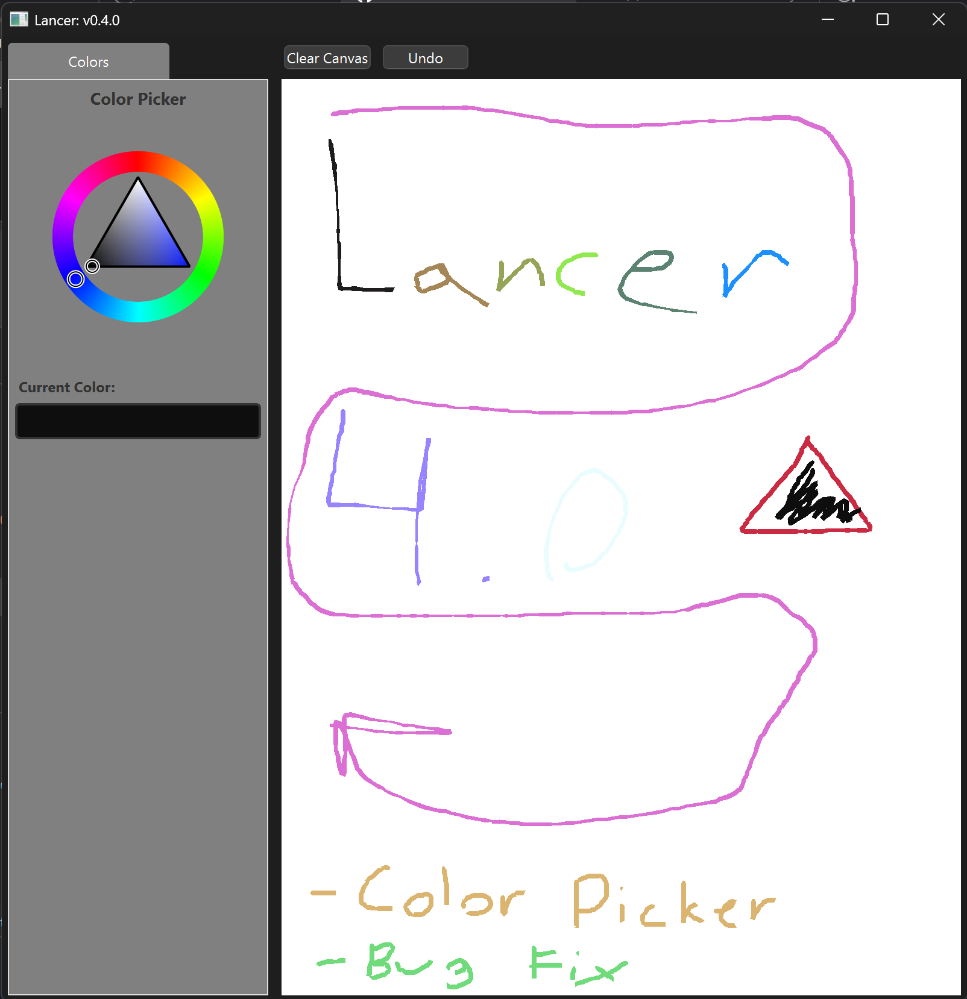

<!-- Screenshot -->
<p align="center">
  
</p>

---

# 🎨 ProLancer

A modern, OpenGL-powered collaborative canvas — inspired by Krita but built for freelancers, real-time tools, and buttery smooth drawing.

> Built with Qt + QOpenGL, hand-coded geometry, and future-proof vibes.

---

## 🚀 Features

- ✏️ **Pressure-sensitive strokes** with triangle strip rendering
- ⚙️ Real OpenGL performance (not just a widget hack)
- 🎨 Custom brush pipeline (coming soon)
- 🔄 VBO-backed rendering for stability and speed

---

## 📸 Preview

Here’s what it looks like in action:

TODO

---

## 🧑‍💻 Building It Yourself

```bash
git clone https://github.com/yourusername/ProLancer.git
cd ProLancer
mkdir build && cd build
cmake ..
make
./ProLancer
